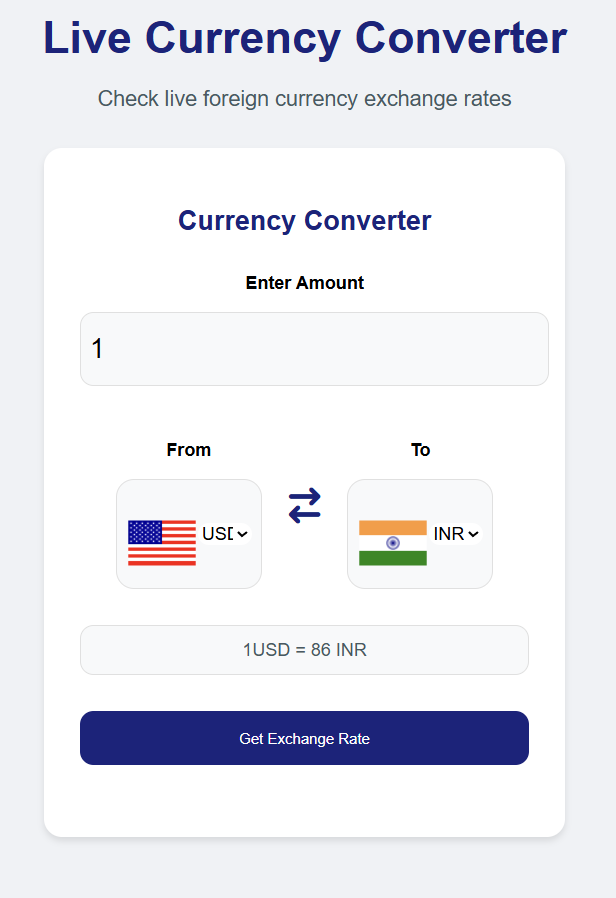

# Live Currency Converter

A modern, user-friendly web application that allows users to check live foreign currency exchange rates and convert between different currencies in real-time.


## Features

- 💱 Real-time currency conversion
- 🌍 Support for multiple currencies worldwide
- 🎨 Modern and responsive user interface
- 🔄 Swap currencies with one click
- 🏳️ Country flags for easy currency identification
- 📱 Mobile-friendly design

## Technologies Used

- HTML5
- CSS3
- JavaScript
- Font Awesome for icons
- Flags API for country flags


## Setup and Installation

1. Clone the repository
```bash
git clone https://github.com/yourusername/currency-converter.git
```

2. Navigate to the project directory
```bash
cd currency-converter
```

3. Open the project
- Simply open the `index.html` file in your web browser


## Usage

1. Enter the amount you want to convert in the "Enter Amount" field
2. Select the currency you want to convert from in the "From" dropdown
3. Select the currency you want to convert to in the "To" dropdown
4. Click "Get Exchange Rate" to see the conversion result

## File Structure

```
currency-converter/
│
├── index.html          # Main HTML file
├── style.css          # Styling file
├── script.js          # Main JavaScript file
├── codes.js          # Currency codes and configuration
└── README.md         # Project documentation
```

## License

This project is licensed under the MIT License - see the [LICENSE](LICENSE) file for details.

## Acknowledgments

- Currency data provided by [Exchange Rate API](https://www.exchangerate-api.com/)
- Flags provided by [Flags API](https://flagsapi.com/)
- Icons by [Font Awesome](https://fontawesome.com/) 
